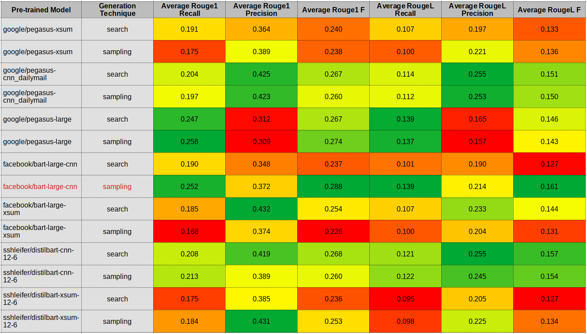

# What is this?

A simple project that helped me to choose a SOTA neural model for summarization. It contains a bash script that iterates over all possible combinations of:
- Models to choose from
- Generation techniques
- Articles from a test corpus

This script executes a Python script that uses HuggingFace's pre-trained models over the XSum and CNN / Daily Mail datasets. The generated summaries are scored with ROUGE1 and ROUGEL to have a numerical idea about how each model performs.

This repository is the accompanying code of the article "_A technical primer on neural summarization and SOTA model selection with HuggingFace Transformers_ 🗜️" available [here](https://ivanperez.pe/blog/nlp08-summarization-primer).

# How can I use it?

You can call the bash script (`runner.sh`) to run all combinations and produce a CSV file with the ROUGE scores for later analysis or run the Python script to summarize a single document.

As a reference, these are the results I got on my first run:

<p align='center'>
    
    <br>
    <span align='center' style="font-size: smaller;">Source: Own</span>
</p>

If you want to try the Python script, you first have to install the dependencies (see the `pyproject.toml` file) and then take into account that the following parameters are mandatory:
- `model_name`: The name of the pre-trained model to use.
- `article`: The relative path to a text file containing the input document and a gold standard. Use the `***` sequence as a separator.
- `generation`: The decoding strategy to use.

Check the bash script for all possible values. For example, the next instruction will summarize the article in file `one.txt` using Beam Search with the PEGASUS model over the XSum dataset. 

```shell
$ python summarize.py --model_name="google/pegasus-xsum" --article="articles/one.txt" --generation="search"
```
Besides the summary of the input document, the script, with a tweak, will return all ROUGE scores :).

# Where can I learn more about NLP?

You can check [this repository](https://github.com/ig-perez/nlp-roadmap) or read some of [my blog posts](https://ivanperez.pe/blog). Have fun! :)
